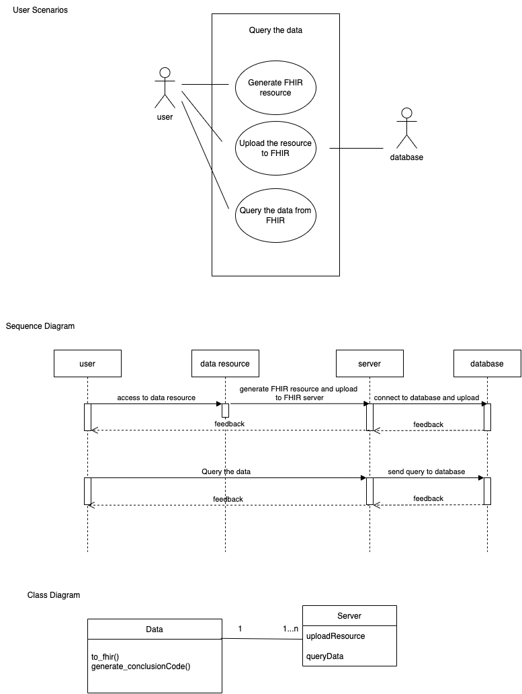

`Data.py` is a class about converting json or csv files to FHIR resource. `line 7` to `line 95` in `DataQuery.py` is to generate FHIR resources by using Data class. 7 json files will be generated after running the code in `DataQuery.py`. These files follow FHIR rules (r4) and they are ready to send to FHIR server.

`Server.py` is a class about uploading the FHIR resources to server and query the data in the server. `line 98` to `line 104` in `DataQuery.py`is an example about how to query the data in the server.

The program supports `Python3.7`

#

Below is my architecture diagram about querying the data:



The whole process about query the data from the server is 
1. generates FHIR resources from different data source (json or csv)
2. uploads FHIR resources into server
    
    this will have two different returns. If the resource uploads successfully, the system will show `Successfully created resources on the server`, otherwise, the system will return the error code
3. queries the data from server

    this will have two different returns. If the system can query the data from the server, it will show `Successfully query the data from server`, and list all the potential resources. If failed, the system will show the error code and `Failed to query the data`

As for the API request, we need to know the headers. Here I assume 
```
headers={"Content-Type":"json"}
```
HTTP GET command is used to access the current contents of a resource and return the instance with the content specified for the resource type. Below is the command line 
```
GET [base]/[type]?query
```
`base` represents the server base URL

`type` represents the name of a resource type (e.g. "Patient")

`query` represents the query condition. For example, you want to find the Diagnostic Report that the `conclusion` is `IgA glomerulonephritis`. In this case, the `query` is `conclusion=IgA glomerulonephritis`

This command will return all matching records in one response.

Here is an small example about query the data from server. We assume 

1. the base URL is http://localhost:8000/
2. the content-type is json
3. upload one resource (A0001.json) to the server

```python
import json
from Server import Server

r = json.load("A0001.json")
headers={"Content-Type":"json"}
s = Server("http://localhost:8000", headers)
# upload the resource to server
s.uploadResource("DiagnosticReport", r)
# query the data from server
s.queryData("DiagnosticReport", "conclusion=Gitelman syndrome")
```
